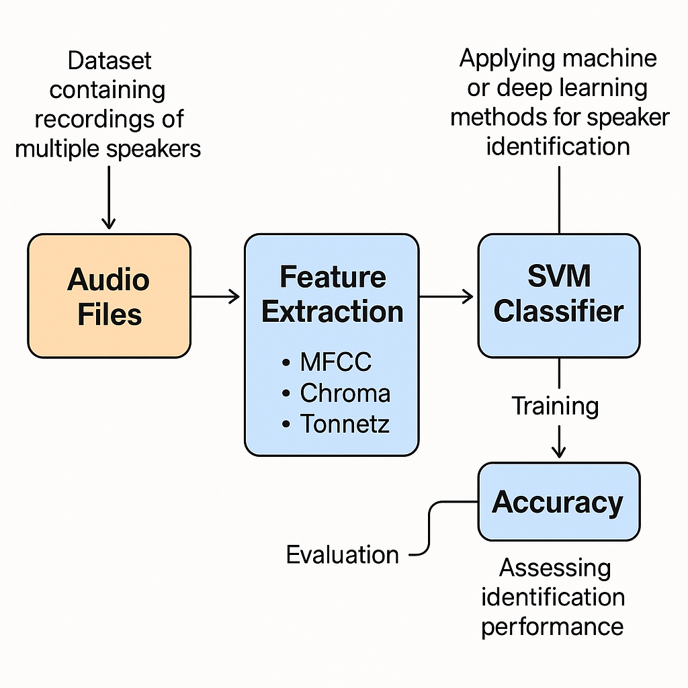

# Kalbėtojo atpažinimas naudojant mašininį mokymąsi

## Tikslas
Sukurti sistemą, kuri geba atpažinti kalbėtoją iš trumpų garso įrašų, taikant mašininio mokymosi metodus.

## Duomenys
- Naudotas kelių kalbėtojų garso įrašų rinkinys (10 kalbėtojų, po kelis įrašus kiekvienam).
- Įrašai trumpi (1–3 sekundės), WAV formatu.
- Katalogo struktūra:
  ```
  dataset/
  ├── speaker1/
  ├── speaker2/
  └── ...
  ```
  
## Požymių išgavimas
Iš kiekvieno įrašo išgauti šie požymiai:
- MFCC (13 koeficientų, su vidurkiu ir standartiniu nuokrypiu)
- Chroma (vidurkis ir standartinis nuokrypis)
- Tonnetz (vidurkis ir standartinis nuokrypis)

Trumpi įrašai (<2048 mėginių) buvo automatiškai prailginti nuliais (zero-padding), kad būtų užtikrintas skaičiavimų stabilumas.

## Klasifikavimo modelis
Naudotas SVM (Support Vector Machine) su `linear` branduoliu.

- Požymiai normalizuoti naudojant `StandardScaler`.
- Duomenys padalyti: 80% – mokymui, 20% – testavimui.

## Rezultatai

| Rodiklis | Reikšmė |
|----------|---------|
| Tikslumas (accuracy) | 100.00% |
| Klasifikavimo ataskaita | Visos klasės atpažintos be klaidų |
| Confusion matrix | Jokios klasifikavimo klaidos |

## Eksperimentas su triukšmu
Buvo pridėtas white noise (noise_level = 0.05) prie testavimo požymių.

| Būsena | Tikslumas |
|--------|-----------|
| Be triukšmo | 100.00% |
| Su triukšmu | 100.00% |

Pastaba: triukšmas buvo pridėtas prie išskaičiuotų požymių. Realistiškesniam testavimui rekomenduojama triukšmą taikyti tiesiai WAV įrašams prieš požymių skaičiavimą.

## Sistemos schema



## Išvados
- Modelis sėkmingai atpažino visus kalbėtojus, net esant labai trumpiems įrašams.
- MFCC, Chroma ir Tonnetz požymiai pasirodė esantys labai efektyvūs.
- SVM modelis su linear branduoliu buvo tinkamas pasirinkimas šiai užduočiai.
- Tolimesniems bandymams verta įtraukti triukšmą ankstesnėse stadijose bei didesnius, įvairesnius duomenis.